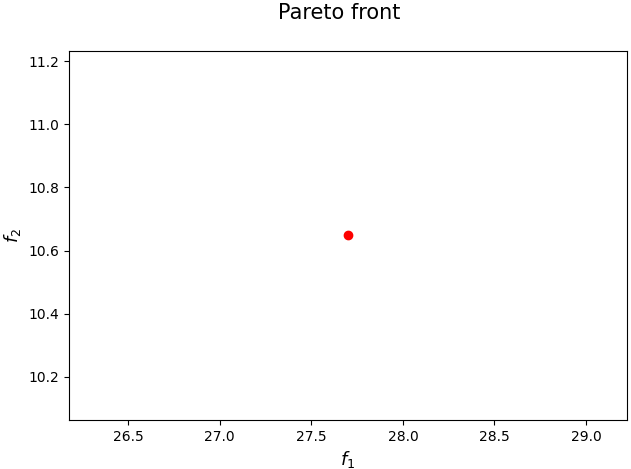
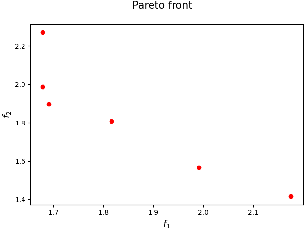

[](https://www.python.org/downloads/release/python-3110/)
[](https://opensource.org/licenses/Apache-2.0)

<p>
  
   
</p>

## Front Descent Framework for Multi-Objective Optimization

Implementation of the FD framework proposed in 

[Lapucci, M., Mansueto, P. & Pucci D., Effective Front-Descent Algorithms with Convergence Guarantees. arXiv pre-print (2024)](
https://arxiv.org/abs/2405.08450)

If you have used our code for research purposes, please cite the publication mentioned above.
For the sake of simplicity, we provide the Bibtex format:

```
@misc{lapucci2024effective,
  title={Effective Front-Descent Algorithms with Convergence Guarantees}, 
  author={Matteo Lapucci and Pierluigi Mansueto and Davide Pucci},
  year={2024},
  eprint={2405.08450},
  archivePrefix={arXiv},
  primaryClass={math.OC}
}
```

### Main Dependencies Installation

In order to execute the code, you need an [Anaconda](https://www.anaconda.com/) environment and the Python packages [nsma](https://pypi.org/project/nsma/), [pymoo](https://pypi.org/project/pymoo/) installed in it. For a detailed documentation of the nsma package we refer the reader to its [GitHub repository](https://github.com/pierlumanzu/nsma), while for the pymoo package we refer to the [website](https://pymoo.org/).

For the packages installation, open a terminal (Anaconda Prompt for Windows users) in the project root folder and execute the following commands. Note that a Python version 3.10.6 or higher is required.

```
pip install nsma
pip install pymoo
```

##### Gurobi Optimizer

In order to run some parts of the code, the [Gurobi](https://www.gurobi.com/) Optimizer needs to be installed and, in addition, a valid Gurobi licence is required.

### Usage

In ```parser_management.py``` you can find all the possible arguments. Given a terminal (Anaconda Prompt for Windows users), an example of execution could be the following.

``` python main.py --algs FD_BB --probs JOS --plot_pareto_front --plot_pareto_solutions --general_export --export_pareto_solutions --FD_eps_hv 0.0001 ```

### Contact

If you have any question, feel free to contact us:

[Pierluigi Mansueto](https://webgol.dinfo.unifi.it/pierluigi-mansueto/), [Davide Pucci](https://webgol.dinfo.unifi.it/davide-pucci/)<br>
Global Optimization Laboratory ([GOL](https://webgol.dinfo.unifi.it/))<br>
University of Florence<br>
Email: pierluigi dot mansueto at unifi dot it, davide dot pucci at unifi dot it
